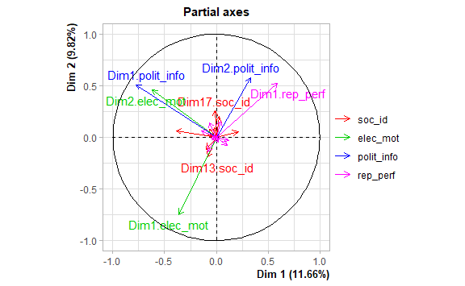

# Introduction

Parliamentary questions (PQs) are a common feature in Westminster-style Parliaments where representatives ask questions on any topics to ministers. Due to the relative low party control over PQ use, PQs are a uniquely valuable dataset to track the representative orientations of MPs, such as their policy interests and preferences. Existing studies of PQs around the world have combined PQ data with MP-level characteristics to study various hypotheses of what drives PQ topics, including individual demographic factors like race and gender, electoral factors like winning margin or political section, and institutional factors like parliamentary roles and party affiliation.

However, existing literature is limited to understanding isolated relations between individual factors and PQ activity outcomes. There is a lack of a holistic analysis simultaneously considering all available factors of MP-level traits and PQ activity, to understand broader typologies of MPs and their PQ representative behaviour.

We explore this question through an unsupervised data-driven analysis that exploits publicly available PQ text data of all 8246 PQs filed in Singapore's Parliament from 2011 to 2020 by 100 MPs, together with data on the MP's personal identities, electoral background, and institutional affiliations.

```{r setup, include=FALSE}

library(pacman)
packs<-c("tidyverse","kableExtra","patchwork","Hmisc","psych","here","FactoMineR","igraph","factoextra","NbClust")
pacman::p_load(char = packs,character.only = T)

data_path<- here::here("data-master","project-data")
graph_path<- here::here("Graphs")

knitr::opts_chunk$set(echo = FALSE,
dev = "ragg_png",
dpi = 320,
out.width = "100%",
fig.width = 6,
fig.asp = 0.618,
fig.retina = 2,
fig.align = "center",
fig.show = "hold",
fig.path = here("Graphs","figure-"))

data<- read.csv(file = file.path(data_path,"MP stats.csv"),
                header = T,
                dec = ".",
                strip.white = T,
                stringsAsFactors = T,
                na.strings = c(""," ",NA)
                )


data$Age_cat<- ifelse(data$Age >= quantile(data$Age)[1] & data$Age < quantile(data$Age)[2],paste0(quantile(data$Age)[1],"-",quantile(data$Age)[2]),
                      ifelse(data$Age >= quantile(data$Age)[2] & data$Age < round(quantile(data$Age)[3]),paste0(quantile(data$Age)[2],"-",round(quantile(data$Age)[3])),
                             ifelse(data$Age >= round(quantile(data$Age)[3]) & data$Age < quantile(data$Age)[4],paste0(round(quantile(data$Age)[3]),"-",quantile(data$Age)[4]),
                                    ifelse(data$Age >= quantile(data$Age)[4] & data$Age <= quantile(data$Age)[5],paste0(quantile(data$Age)[4],"-",quantile(data$Age)[5]),"undefined"))))

data$Age_cat<- factor(data$Age_cat,levels = c( "26-40","40-46","46-51","51-62"))
data$GRC<- factor(data$GRC,levels = c(levels(data$GRC),"Not Applicable"))
data$GRC[is.na(data$GRC)]<-"Not Applicable"

data<- data %>% drop_na()

```

# Notes and to-do:

1)  Adjust the scales and legends of the visualizations for the presentation

2)  Reduce dimensions

3)  Do clustering

    -   K-means
    -   Hierarchical
    -   LPA

4)  Visualize the cluster centroids

    -   Radar plot
    -   Lollipop plot
    -   Good old bar-plot/scatter-plot

5)  Add Hasti's code chunk into the document

# Data Overview

Let's start by examining the data. Below are the descriptive statistics

```{r descriptive stats, eval=T}


soc_id_desc<- apply(data[,c("Race","Gender","Age_cat","Edu","Career")],MARGIN = 2,FUN = table) %>% unlist()
soc_id_desc_df<- cbind(str_split(string = names(soc_id_desc),pattern = "\\.",simplify = T),
                       soc_id_desc) %>% as.data.frame() %>% set_names(nm = c("variable","category","freq"))

soc_iden_desc_plot<-soc_id_desc_df %>%
  mutate(perc = round(((as.numeric(freq)/134)*100))) %>%
  ggplot(aes(x = variable, y= perc, fill = category))+
  geom_bar(color = "gray50",stat = "identity",position = "stack")+
  geom_text(aes(label = perc),position = position_stack(vjust = .5))+
  theme_light()+labs(x = "Social identity indicators",y = "Percentage",title = "Descriptive stats of social identitiy indicators",subtitle = "N = 134")


elec_mot<- data %>% select(Parl,Name,Win,Ret,Exp)

elec_mot_desc <- data %>%
  summarise(win_perc = round(mean(Win)),
            Ret_perc = round((sum(Ret)/134)*100),
            Exp_mean = round(mean(Exp))) %>% 
  pivot_longer(cols = everything(),names_to = "variables",values_to = "values")

elec_mot_desc_plot<- elec_mot_desc %>%
  ggplot(aes(x = variables,y = values)) +
  geom_bar(aes(fill = values),stat = "identity",position = "dodge")+
  theme_minimal()+labs(x = "Electoral motivation indicators",y = "Mean",title = "Mean values of electoral motivation indicators",subtitle = "N = 134")

#Parliamentary Bodies indicator is not in the data
pol_minst<- data %>% select(Parl,Name,MP,Party)

pol_minst_mp <- data %>%
  count(MP,name = "freq") %>%
  mutate(perc = round((freq/134)*100,1)) %>%
  rename(variables = MP)

pol_minst_mp_plot<- pol_minst_mp %>% ggplot(aes(x = variables, y = perc))+
  geom_bar(aes(fill = perc),stat= "identity",position = "dodge")+
  theme_minimal()+labs(x = "Non-Electoral Schemes", y= "Perc",title = "Political Micro-institution indicator: Non-electoral schemes", subtitle = "N = 134")

pol_minst_party<- data %>%
  count(Party, name = "freq") %>%
  mutate(perc = round((freq/134)*100,1)) %>% 
  rename(variables = Party)

pol_minst_party_plot<- pol_minst_party %>% ggplot(aes(x = variables, y = perc))+
  geom_bar(aes(fill = perc),stat= "identity",position = "dodge")+
  theme_minimal()+labs(x = "Political Parties", y= "Perc",title = "Political Micro-institution indicator: Party control", subtitle = "N = 134")


(pol_minst_mp_plot + pol_minst_party_plot + elec_mot_desc_plot) / soc_iden_desc_plot

```

## Imputations

Upon closer examination, it seems that there are two groups of NAs. The first group, which is indicated by the low frequency of NA in figure above, indicates MPs were probably inactive during the period. This assumption is also corroborated by the fact that they have 0 questions asked. In order to handle this, we simply replaced the numeric indicators on questions for these observations with 0.

For the win variable, if they have a party affiliation put the average winning percentage for the party in NAs. For independents either put 0 to indicate they were nominated by public or replace them with sample mean.

Ret: if the candidate is publicly nominated, ret = 1, if they are best losers, Nym will look it up.

Exp: if publicly nominated (MP = NMP) 0,

NOTE: for now, ignore NMP and NCMP for the analysis. More data on them will come later.

GRC is not applicable to those who are the best losers and nominated by the public. We will ignore the variable in the subsequent analysis

## Data transformations

### Representative performance:

The last dimension in our elected representatives typology is the representative performance. We conceive representative performance as the policy focus and intensity with which the elected representative fulfill their mandate. To approximate the policy focus, we make use of the parliamentary question sessions where the MPs pose questions to various ministries in Singapore. We argue that these questions indicates two key factors. First of which is the salient policy issues for the MPs, thus give us an insight into the policy focus of MPs during their representative mandate. The secondly, the frequency of asking questions indicates how hard the MPs work to fulfill their representative mandate. We can summarize our conceptualization of representative performance in a simple 2x2 table:

+--------------------------+----------------------------+----------------------------+
|                          | Low intensity of questions | High intensity of Question |
+==========================+============================+============================+
| **Narrow policy focus**  | TYPE A                     | TYPE B                     |
+--------------------------+----------------------------+----------------------------+
| **Diverse policy focus** | TYPE C                     | TYPE D                     |
+--------------------------+----------------------------+----------------------------+

: Representative Performance

We measure the intensity of representative performance as the number of questions asked by an MP per parliamentary season.**[Nym needs to double check these claims!]** While there are some restrictions imposed on the number of questions an MP can ask per session, how often MPs can join in the question session is up to them. Therefore, number of questions per season can serve as a suitable proxy on how much effort MPs spend to fulfill their mandate.

We approximate the diversity of policy focus of MPs via two indicators. Our first indicator is the number of times an MP has addressed different ministers. Since ministers have relatively narrower, and pre-determined, policy focus, choosing a minister as an addressee of a question roughly indicates the policy focus of the question. Thus, more diverse the addressees through out a parliamentary season, more diverse the policy focus of the MP. Our second indicator, on the other hand, zooms in on the substance of the questions. While addressee ministers gives us a impression of the diversity of policy focus of the MP, it is not a fine grained picture of the policy focus. Even though the ministers have a limited policy area, they have authority over wide variety of the issues concerning a policy area. For example, minister of defense can not only be responsible for military but also non-military related security issues such as refugees. To identify the policy area of the questions asked by MPs, we ran Dirichlet Multinominal Mixture Mode(GSDMM) (Yin and Wang, 2014) topic modeling on the question texts. Compared to more established topic modeling strategies such as LDA and STM, DMM has been shown to infer the number of clusters automatically with a good balance between the completeness and homogeneity of the clustering results using short text. Since the average length of parliamentary questions is 35 words, GSDMM proved to be a more suitable method.

```{r addresse_frequency, echo=F,eval=T}

addressee_data<- data %>% select(Parl,Name, Sum,MCCY:PMO)

ministery<- colnames(addressee_data)[4:20]

addressee_freq<- addressee_data[1:3]

for (i in 1:length(ministery)) {
  addressee_freq[,paste0(ministery[i],"_freq")]<- round(addressee_data[,"Sum"]*addressee_data[,ministery[i]])
}

question_freqs_long<- addressee_freq %>% pivot_longer(cols= MCCY_freq:PMO_freq, names_to = "ministry",values_to = "addressee_freq")

addressee_plot<- question_freqs_long %>%
  ggplot(aes(x = Name, y= addressee_freq,group = ministry))+
  geom_bar(aes(fill = ministry),stat= "identity",position = "stack",color = "gray50")+
  facet_wrap(~Parl)+theme_minimal()+coord_flip()+labs(x = "MPs",y="Addressee Frequency",title = "Frequency of Ministries as addressees",subtitle = "N of MP = 134 \nN of ministries = 17")


addressee_plot  
```

```{r topic_frequency}

question_data<- readRDS(file = paste0(data_path,"/Questions_topics.RDS")) %>%
  mutate_at(vars(topic_10,topic_15),~as_factor(.))

question_freq_15<- question_data %>% group_by(Parliament,MP,topic_15) %>% summarise(topic_freq = n())

question_freq_10_plot<- question_freq_15 %>%
  ggplot(aes(x = MP, y = topic_freq,group = topic_15))+
  geom_bar(aes(fill = topic_15),color = "gray50",stat = "identity",position = "stack")+
  facet_wrap(~Parliament)+coord_flip()+theme_minimal()+labs(x = "MP",y = "Topic frequency", title = "Topic frequencies by MPs", subtitle = "N of MPs = 134 \nN of topic = 15" )

question_freq_10_plot
```

Lets check the correlation between the topics frequencies and ministerial addressees:

```{r topic_addressee_cor, echo=F,eval=T}

corr_data<- question_freq_15 %>%
  pivot_wider(id_cols = Parliament:MP,
              names_from = topic_15,
              values_from = topic_freq,
              values_fill = 0) %>%
  rename(Parl = Parliament, Name = MP) %>%
  right_join(.,addressee_freq,by = c("Parl","Name"),
             na_matches = "never") %>%
  ungroup() %>%
  select(-Parl,-Name,-Sum) %>%
  mutate(across(everything(),as.numeric))

topic_add_corr<- cor(corr_data,method = "pearson",use = "complete.obs") %>% reshape2::melt()

topic_add_corr %>% ggplot(aes(x=Var1, y=Var2, fill=value)) + 
  geom_tile()

```

```{r speaker_addressee_network, eval=FALSE, echo=F}
addressee_network_12<- addressee_freq %>% filter(Parl == 12) %>% select(-Parl,-Sum)
colnames(addressee_network_12)<-gsub("_freq","",colnames(addressee_network_12))

addressee_network_12<-addressee_network_12[!duplicated(addressee_network_12$Name),] %>% column_to_rownames(var="Name")

addressee_network_12_adj<- addressee_network_12 %>% as.matrix()

network_adr<- graph_from_incidence_matrix(addressee_network_12_adj)

plot(network_adr)

```

Ugly as hell bi-partite network graph of MPs and ministers. Need to polish this a lot

```{r speaker_topic_network,eval=FALSE,echo=FALSE}

topic_network_12<- question_data %>%
  group_by(Parliament,MP,topic_15) %>%
  summarise(topic_freq = n()) %>%
  filter(Parliament == 12)

topic_network_12_inc<- topic_network_12 %>%
  pivot_wider(id_cols = Parliament:MP,
              names_from = topic_15,
              values_from = topic_freq,
              values_fill = 0) %>%
  ungroup() %>%
  select(-Parliament) %>%
  column_to_rownames(var = "MP") %>%
  as.matrix()

topic_network_12_graph<- graph_from_incidence_matrix(topic_network_12_inc)

plot(topic_network_12_graph)

```

Again ugly as hell bi-partite network graph of Topic and MPs. Needs polishing. Might switch to ggraph.

### Extracting principle components:

For dimension reduction, we employ Multiple Factor Analysis (MFA) (Becue-Bertaut and Pages, 2008). MFA is a dimension reduction method that combines traditional principle component analysis and multiple correspondence analysis under one hood. The motivation behind our dimension reduction is two folds. First, our indicators are of different type and different scale. Most geometry based clustering algorithms such as k-means and k-medioids are extremely sensitive to variable type and scale. By applying MFA, we would be rescaling our indicators and convert them into same type (i.e continious). Secondly, we have 44 indicators in total measuring 4 different dimensions;social identity, electoral motivations,political micro-institutions and representative performance. A clustering based on 44 variables would risk unsatisfactory groups due to idiosyncratic variance in variables thus producing hard to understand results. Applying MFA eliminates the risk of idiosyncratic variance in the clustering, thus making clustering results more coherent.

```{r social_identity,eval=T,echo=F}
mfa_data_12_a<- data %>% select(Parl,Name,Race,Gender,Age_cat,Edu,Career,Exp,Win,Ret,GRC,MP,Party)

mfa_data<-left_join(x = mfa_data_12_a,y = addressee_freq,by = c("Parl","Name")) %>%
  distinct(Parl,Name,.keep_all = T) %>% select(-Parl,-Name) 


#mfa_data$Parl<-factor(mfa_data$Parl,levels = c(12,13))

race_key<- c(C = "Chinese",I = "Indian",M = "Malay",O = "Others")
gender_key<- c(M = "Male",F ="Female")
edu_key<- c(B = "Bachelor",M = "Master",P = "PhD",T = "Technical")

mfa_data$Race<- recode_factor(mfa_data$Race,!!!race_key)
mfa_data$Gender<- recode_factor(mfa_data$Gender,!!!gender_key)
mfa_data$Edu<- recode_factor(mfa_data$Edu,!!!edu_key)

mfa_data$Muslim_freq<-NULL

mfa_res<- MFA(base = mfa_data,group =c(5,3,3,17),name.group = c("soc_id","elec_mot","polit_micro_inst","rep_perf"),
              type = c("n","s","n","s"),ncp = 17,graph = F)

eigen_Vals<- get_eigenvalue(mfa_res) %>% as.data.frame() %>% rowid_to_column(var = "dimension") %>% filter(variance.percent >=1)


eigen_Vals %>%
  ggplot(aes(x = dimension,y = round(variance.percent)))+
  geom_bar(aes(fill = variance.percent),stat= "identity",position = "dodge") +
  geom_vline(xintercept = 8,color = "red", size = 1)+geom_vline(xintercept = 17,color = "green",size = 1)+
  annotate("text", x = 7,y = 11,label = "Keiser Criteria \n(eigen >= 0.7)\n 7 dimensions",color = "red")+
  annotate("text", x = 18, y = 11, label = "Common sense criteria \n(Total var exp = 80%)\n 17 Dimensions",color = "green")+
  theme_minimal()+labs(x = "Dimensions",y = "Percentage of variance explained",title = "Multiple Factor Analysis Results")

                        


```


### Clustering:

```{r clustering_kmeans,echo=F,eval=T}
clustering_data<- mfa_res$global.pca$ind$coord %>% as.data.frame()

optimal_k<- NbClust(data = clustering_data,distance = "euclidean",min.nc = 2,max.nc = 10,method = "kmeans")
set.seed(123)
mp_clusters<- kmeans(x = clustering_data,centers = 9,iter.max = 25)

```
```{r cluster_manual_viz,eval=T,echo=F}

mfa_data$cluster<-mp_clusters$cluster

getmode <- function(v) {
   uniqv <- unique(v)
   uniqv[which.max(tabulate(match(v, uniqv)))]
}


soc_identity_summary<-mfa_data %>% group_by(cluster) %>% summarise(Race_mode = getmode(Race),
                                                                   Gender_mode = getmode(Gender),
                                                                   Edu_mode = getmode(Edu),
                                                                   Career_mode = getmode(Career),
                                                                   Age_mode = getmode(Age_cat))

soc_identity_summary %>% kbl(caption = "Modes of Social identity indicators for Clusters") %>%
  kable_classic(full_width = F, html_font = "Cambria")

elec_mode_vis<- mfa_data %>% group_by(cluster) %>% summarise(avg_Exp = round(mean(Exp)),
                                                             avg_Win = round(mean(Win)),
                                                             Ret = round(mean(Ret),2))

elec_mode_vis %>% kbl(caption = "Means of Electoral motivation indicators for Clusters") %>%
  kable_classic(full_width = F, html_font = "Cambria")

pol_inst<-mfa_data %>% group_by(cluster) %>% summarise(GRC_mode = getmode(GRC),
                                                          MP_mode = getmode(MP),
                                                          Party_mode = getmode(Party))

pol_inst %>% kbl(caption = "Modes of Political micro-institution indicators for Clusters") %>%
  kable_classic(full_width = F, html_font = "Cambria")

elec_perf_vis<- mfa_data %>%select(cluster,Sum:PMO_freq) %>%  group_by(cluster) %>% summarise(across(everything(),sum)) %>%
  pivot_longer(cols = Sum:PMO_freq,
               names_to = "ministerial_addressee",values_to = "frequencies")

elec_perf_vis_sum<- elec_perf_vis %>% filter(ministerial_addressee == "Sum")

elec_pref_vis_max<- elec_perf_vis %>%filter(ministerial_addressee != "Sum") %>% 
  group_by(cluster) %>%
  filter(frequencies == max(frequencies)) %>% rbind(.,elec_perf_vis_sum) 


elec_pref_vis_max$cluster<- as.factor(elec_pref_vis_max$cluster)

elec_pref_vis_max %>% ggplot(aes(x = ministerial_addressee,y = frequencies, group = cluster))+
  geom_bar(aes(fill = cluster),stat = "identity",position = "dodge")+
  theme_minimal()+
  labs(x = "Ministerial addressee", y = "Max frequency",title = "Most preferred ministerial addressee by cluster")

```


